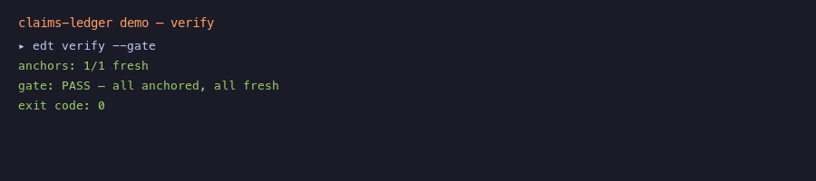

# claims-ledger

> **Every claim in your docs, PRs, and agent decisions carries a machine-verifiable pointer to its source — and CI fails when the pointer goes stale.**

[](.ledger/claims.md)
[](https://github.com/isatimur/claims-ledger/actions/workflows/ledger.yml)
[](https://www.npmjs.com/package/@claims-ledger/edt)

[](demo/scenario.sh)

## Try in 60 seconds

```bash
git clone https://github.com/isatimur/claims-ledger && cd claims-ledger
npm install && npm run build
./demo/scenario.sh
```

You'll see: **verify passes → refactor breaks the anchor (exit 11) → `edt reanchor` fixes it → verify passes again.**

<details>
<summary>Captured terminal output</summary>

See [`demo/output/demo-run.md`](demo/output/demo-run.md).

</details>

Or gate every PR with zero local install:

```yaml
# .github/workflows/ledger.yml
- uses: isatimur/claims-ledger@v1
```

Copy from [`examples/ledger.yml`](examples/ledger.yml) · sandbox template in [`examples/sandbox/`](examples/sandbox/). Optional mirror namespace: [`docs/ACTION-MIRROR.md`](docs/ACTION-MIRROR.md).

---

## Quickstart

```bash
npx @claims-ledger/edt init      # scaffold .ledger/ + pre-commit hook
$EDITOR .ledger/claims.md        # write a claim, anchor it to a commit/doc/ADR
edt verify --gate                # exit 0: all anchors fresh · exit 11: something went stale
```

`edt verify` writes [`.ledger/badge.json`](.ledger/badge.json) (shields.io endpoint schema) — commit it for a live README badge with zero infrastructure.

## Why

Docs rot silently. An agent writes *"auth tokens rotate every 24h"*, someone refactors `rotate.ts`, and the sentence becomes fiction. `claims-ledger` mechanizes the discipline that shipped [fromcopilottocolleague.com](https://fromcopilottocolleague.com):

> **54 claims · 199 anchors · 794-video practitioner corpus** — browse the [evidence graph](https://fromcopilottocolleague.com/read/graph) where every anchor clicks to the exact second of the talk.

Same grammar, now pointing at codebases. **No anchor, no strong claim.**

- A **claim** lives in `.ledger/claims.md` (markdown = source of truth; `ledger.json` = build artifact).
- An **anchor** uses six schemes: `git://`, `doc://`, `adr://`, `gh://`, `yt://`, `ts://`.
- Every anchor carries a **verbatim quote** — resolves at the ref or it doesn't. LLMs can hallucinate justifications; they cannot hallucinate a string into a commit.
- `edt verify` re-resolves every quote (exact → fuzzy 0.87). Stale ⇒ **exit 11**, CI red. `edt reanchor` follows the quote home.

## GitHub Action (Marketplace)

**Auto-Ledger & Verify** — extract, diff, verify, annotate PRs.

```yaml
name: claims-ledger
on: [pull_request, push]
jobs:
  ledger:
    runs-on: ubuntu-latest
    permissions:
      contents: read
      checks: write
      pull-requests: write
    steps:
      - uses: actions/checkout@v4
        with: { fetch-depth: 0 }
      - uses: isatimur/claims-ledger@v1
        with:
          openrouter-api-key: ${{ secrets.OPENROUTER_API_KEY }}  # optional: extract + judge panel
      - uses: actions/upload-artifact@v4
        with:
          name: ledger-report
          path: .ledger/ledger-report.md
```

| Mode | What it does |
|------|----------------|
| `verify` | Freshness-check every anchor; fail on stale (default gate) |
| `extract` | Mine candidate claims from PR diffs → `.ledger/claims.proposed.md` |
| `both` | Extract then verify |

Marketplace submission steps: [`docs/MARKETPLACE.md`](docs/MARKETPLACE.md).

## Books of Truth — event ledgers

Process a keynote into timestamp-anchored claims:

```bash
node scripts/event-ledger.mjs am_oeAoUhew "Harness Engineering"
# → examples/ledgers/openai-harness-engineering-2025/
```

Sample ledger: [OpenAI Harness Engineering (Ryan Lopopolo)](examples/ledgers/openai-harness-engineering-2025/) — 5 claims anchored to the second, sourced from the book corpus (honestly labeled). **Live:** [fromcopilottocolleague.com/ledgers/openai-harness-engineering-2025](https://fromcopilottocolleague.com/ledgers/openai-harness-engineering-2025).

## Architecture

```
.ledger/claims.md  ──parse──►  ledger-core  ──verify──►  exit codes / check-run
     ▲                          │  parser (byte-compatible with the book's grammar)
     │ edt init/reanchor        │  6 anchor schemes · differ · resolver cascade
     │                          │  judge-panel median (3 rivals, spread>20 flags)
   edt CLI ◄────────────────────┘
     │
     └── trace-v1: agents attach a micro-ledger of anchored decisions to every PR
                   (edt trace new → add-decision → render --format pr-body)

packages/
  ledger-core   parser · anchors · differ · resolver · verifier · panel
  edt           CLI — init/trace/verify/reanchor/render/export/mcp
  action        auto-ledger-verify GitHub Action
```

**Gate exit codes:** `0` fresh · `10` tentative · `11` stale · `12` panel spread>20 · `13` trace missing · `2` internal.

## For agents

Attach an **Evidence Decision Trace** to every PR — fabricated quotes rejected at add time:

```bash
edt trace new --pr 481
edt trace add-decision \
  --text "Moved JWT verification into gateway/auth/" \
  --anchor "doc://docs/adr/0007-auth-module-boundaries.md#decision@e91b3d0" \
  --quote "crypto-touching code lives under gateway/auth/ exclusively" \
  --confidence high
edt render --format pr-body
```

**Claude Code / Cursor skill:** [`skills/claims-ledger/SKILL.md`](skills/claims-ledger/SKILL.md) + hook to require traces on agent stop.

**MCP:** `edt mcp serve` — `ledger_search`, `trace_add_decision`, `anchor_verify`, `ledger_claims`.

## Flagship dataset

The book's Claims Ledger is the first public `.ledger/` — `ledger-core` parses it byte-compatibly:

```
$ edt verify
anchors: 0/199 fresh · 199 unverifiable (never gate)
$ echo $?
0
```

**54 claims** (44 strong / 10 moderate) · **199 anchors** · **794 videos**. Offline `yt://` anchors report *unverifiable* rather than assumed fresh. Interactive graph: [fromcopilottocolleague.com/read/graph](https://fromcopilottocolleague.com/read/graph).

## Status

**v1.0.0** — Marketplace-ready: root `action.yml`, demo GIF, social preview, HN post pack. Core: judge panel, extract mode, MCP, badge, event ledger sample, agent skill.

Show HN: [`docs/HN-POST-READY.txt`](docs/HN-POST-READY.txt) · Marketplace: [`docs/MARKETPLACE.md`](docs/MARKETPLACE.md) · Roadmap: [`LAUNCH.md`](LAUNCH.md)
